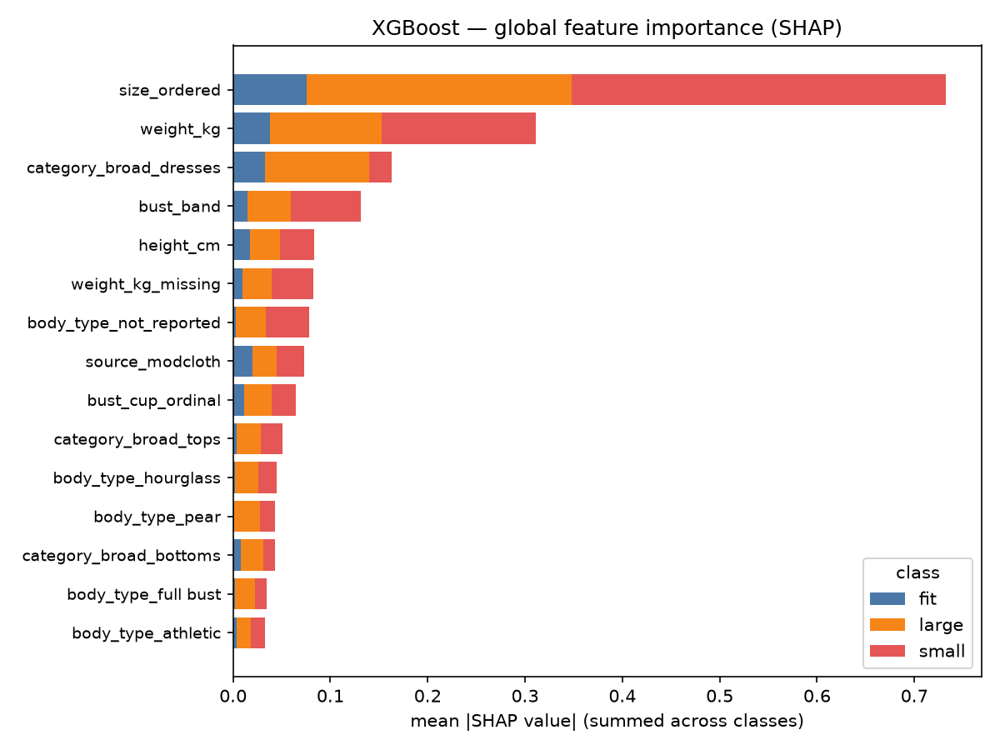
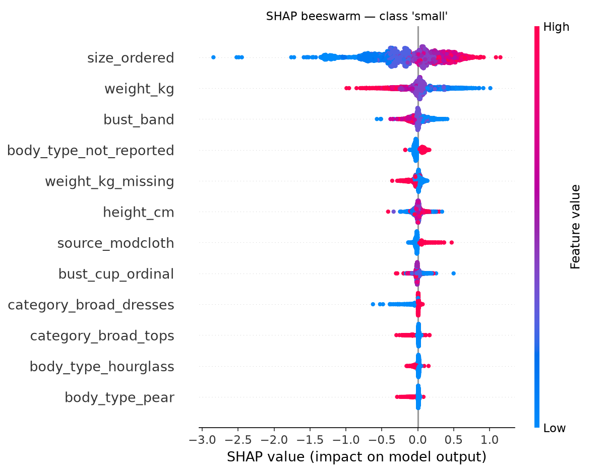
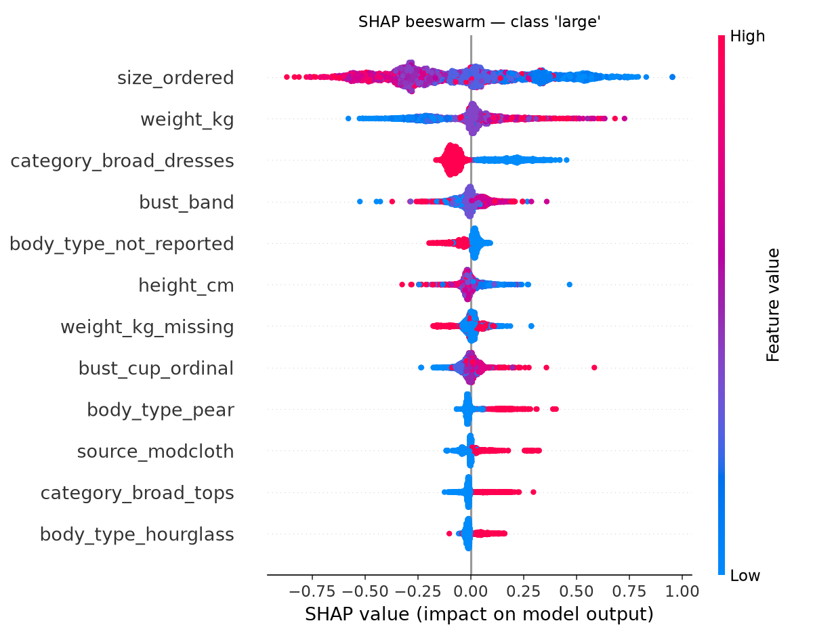
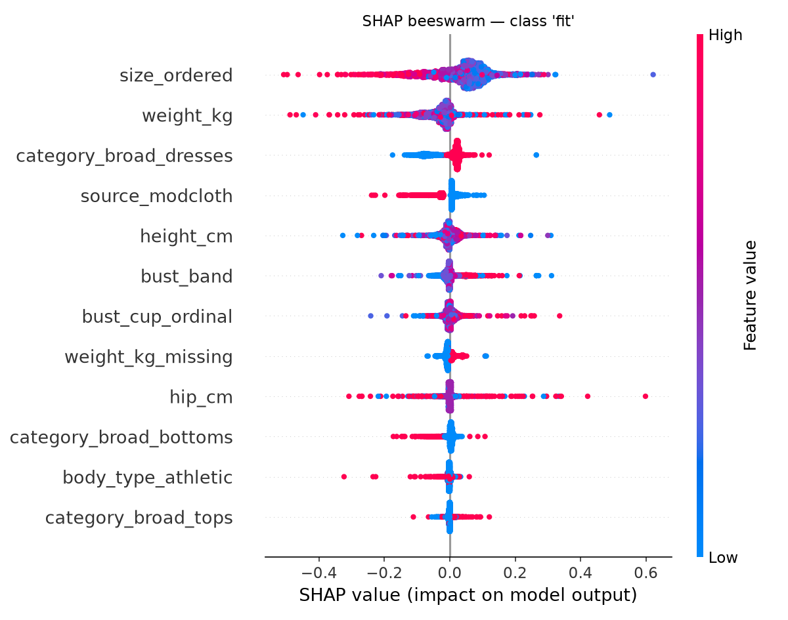
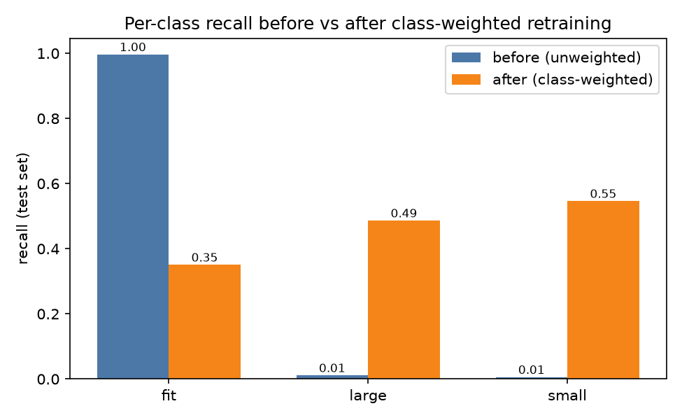

# FitML — Fairness & Bias Audit Report (Phase 6)

**Model audited:** XGBoost — the Phase 5 winner, selected by macro-F1
([models/xgboost.joblib](../models/xgboost.joblib), training setup in
[models/training_config.json](../models/training_config.json)).
**Evaluation data:** the exact 50,210-row held-out test set pinned in
[models/test_indices.csv](../models/test_indices.csv). The audit script
re-derives the Phase 5 split (seed 42, stratified 80/20) and **asserts the
indices match the pinned file** before computing anything.
**Script:** [src/fairness_audit.py](../src/fairness_audit.py) — fully
reproducible; every number in this report is copied from its generated
output ([assets/fairness/audit_tables.md](assets/fairness/audit_tables.md)).

**Scope note (documented exclusion):** this audit covers the **real women's
dataset and model only** (ModCloth + RentTheRunway). The men's synthetic
extension (~10–15 catalog items, rule-based Uniqlo size-chart lookup, no
trained model) is **excluded**: its synthetic population is too small for
statistically valid group comparisons, and auditing a hand-written lookup
rule against a synthetic population would produce fairness numbers with no
real-world meaning. See
[scope_and_data_provenance.md](scope_and_data_provenance.md).

---

## 1. What is being audited, and for whom

The model predicts fit feedback (`fit` / `large` / `small`) for a garment
order. In the product, a `fit` prediction is the **favorable outcome**: the
shopper gets a confident go-ahead at their usual size. A `small`/`large`
prediction routes them into size-adjustment friction (and, if wrong, into a
return). Two distinct harms matter:

- **Quality-of-service harm:** if the model detects misfits (`small`/`large`)
  worse for some body types or size ranges, those shoppers get more wrong
  "it fits" reassurance — and more returns.
- **Allocation-style harm:** if the model hands out the favorable `fit`
  prediction at very different rates across groups, some groups are
  systematically steered away from their usual size.

### Groups audited

The real dataset supports three groupings (all defined on the pinned test
set; every group has ≥ 1,000 test rows):

| Grouping | Groups | Rationale |
|---|---|---|
| `body_type` (self-reported) | hourglass, athletic, petite, pear, full bust, straight & narrow, apple, not_reported | The core body-shape fairness axis from the Master Plan. `not_reported` is kept as a group: declining to report body shape is itself a meaningful (and large, n=14,800) population. |
| `height_band` (from height_cm) | under 160 cm · 160–169 cm · 170 cm and over | Roughly the petite/average/tall split (25th/75th percentiles are 160/170 cm). |
| `size_band` (from size_ordered) | size 0–6 · 8–14 · 16–22 · 24+ | Ordered US size as a body-size proxy — the axis where sizing tools are most often accused of failing plus-size customers. |

### Fairness metrics

- **Per-group accuracy and per-class recall** (recall of class *c* within a
  group = the group's true-positive rate for *c*).
- **Disparate impact (DI) ratio:** `P(pred = fit | group) / P(pred = fit |
  reference group)`, reference = the group with the highest predicted-fit
  rate. Values **below 0.8 are flagged** (four-fifths rule).
- **Equalized odds:** per-class TPR and FPR compared across groups; we
  report the max-minus-min spread per class.

---

## 2. Baseline audit — the Phase 5 unweighted XGBoost ("before")

Phase 5 headline numbers (test set): accuracy **0.7272**, macro-F1
**0.2918**, per-class recall `fit` **0.9967**, `large` **0.0112**, `small`
**0.0059**. The model is close to a majority-class predictor: it says "fit"
for **99.5%** of all test rows.

### 2.1 Per-group performance — body_type

| group | n | accuracy | recall_fit | recall_large | recall_small | pred_fit_rate | di_ratio | di_flag |
|---|---|---|---|---|---|---|---|---|
| apple | 1000 | 0.6960 | 0.9971 | 0.0066 | 0.0000 | 0.9950 | 0.9971 |  |
| athletic | 8595 | 0.7372 | 0.9965 | 0.0085 | 0.0076 | 0.9952 | 0.9973 |  |
| full bust | 2970 | 0.7111 | 0.9928 | 0.0821 | 0.0043 | 0.9825 | 0.9845 |  |
| hourglass | 11006 | 0.7445 | 0.9987 | 0.0036 | 0.0042 | 0.9979 | 1.0000 |  |
| not_reported | 14800 | 0.7011 | 0.9966 | 0.0095 | 0.0038 | 0.9947 | 0.9968 |  |
| pear | 4397 | 0.7344 | 0.9963 | 0.0034 | 0.0053 | 0.9957 | 0.9978 |  |
| petite | 4485 | 0.7434 | 0.9955 | 0.0033 | 0.0113 | 0.9944 | 0.9965 |  |
| straight & narrow | 2957 | 0.7555 | 0.9955 | 0.0059 | 0.0157 | 0.9936 | 0.9957 |  |

### 2.2 Per-group performance — height_band

| group | n | accuracy | recall_fit | recall_large | recall_small | pred_fit_rate | di_ratio | di_flag |
|---|---|---|---|---|---|---|---|---|
| under 160 cm | 7926 | 0.7239 | 0.9953 | 0.0043 | 0.0020 | 0.9951 | 1.0000 |  |
| 160-169 cm | 25722 | 0.7298 | 0.9972 | 0.0158 | 0.0066 | 0.9945 | 0.9994 |  |
| 170 cm and over | 16562 | 0.7247 | 0.9965 | 0.0076 | 0.0065 | 0.9950 | 1.0000 |  |

### 2.3 Per-group performance — size_band

| group | n | accuracy | recall_fit | recall_large | recall_small | pred_fit_rate | di_ratio | di_flag |
|---|---|---|---|---|---|---|---|---|
| size 0-6 | 11833 | 0.7506 | 0.9965 | 0.0243 | 0.0000 | 0.9929 | 0.9950 |  |
| size 8-14 | 22214 | 0.7413 | 0.9982 | 0.0011 | 0.0041 | 0.9979 | 1.0000 |  |
| size 16-22 | 10314 | 0.6977 | 0.9964 | 0.0066 | 0.0079 | 0.9950 | 0.9971 |  |
| size 24+ | 5849 | 0.6781 | 0.9909 | 0.0197 | 0.0122 | 0.9865 | 0.9886 |  |

### 2.4 Equalized-odds spreads (max − min across groups), baseline

body_type:

| class | tpr_min | tpr_max | tpr_spread | fpr_min | fpr_max | fpr_spread |
|---|---|---|---|---|---|---|
| fit | 0.9928 | 0.9987 | 0.0058 | 0.9579 | 0.9957 | 0.0378 |
| large | 0.0033 | 0.0821 | 0.0789 | 0.0007 | 0.0043 | 0.0036 |
| small | 0.0000 | 0.0157 | 0.0157 | 0.0005 | 0.0035 | 0.0030 |

size_band:

| class | tpr_min | tpr_max | tpr_spread | fpr_min | fpr_max | fpr_spread |
|---|---|---|---|---|---|---|
| fit | 0.9909 | 0.9982 | 0.0073 | 0.9771 | 0.9969 | 0.0198 |
| large | 0.0011 | 0.0243 | 0.0233 | 0.0003 | 0.0060 | 0.0057 |
| small | 0.0000 | 0.0122 | 0.0122 | 0.0000 | 0.0042 | 0.0042 |

(height_band spreads are smaller still — full tables in
[audit_tables.md](assets/fairness/audit_tables.md).)

### 2.5 Reading the baseline honestly: "fair" numbers that mean nothing

**No group is DI-flagged (all ratios ≥ 0.98) — and that apparent fairness is
vacuous.** The model hands the favorable `fit` prediction to *everyone*
(~99.5% of rows in every group), so of course the rates are equal. A model
that always says yes passes the four-fifths rule by construction. This is
exactly why the audit does not stop at disparate impact.

The metrics that look *inside* the predictions show real disparities:

- **Accuracy tracks body size.** size 0–6: 0.7506 → size 24+: 0.6781 — a
  **7.3-point accuracy gap** against plus-size shoppers. Body types with
  lower base rates of "fit" (apple 0.6960, not_reported 0.7011) sit at the
  bottom; because the model almost always predicts "fit", each group's
  accuracy is essentially its own fit base rate. Plus-size customers
  experience misfit more often *and* the model is blindest exactly there.
- **Misfit detection is near zero for everyone, but unevenly so.** The
  `large` TPR spread across body types is 0.0789 — full-bust shoppers get
  their "runs large" cases caught 8.2% of the time, pear-shaped shoppers
  0.34% (a 24× ratio). The `small` class has literally **zero recall** for
  apple body types and size 0–6.
- **The `fit` FPR is 0.96–1.00 in every group:** when an item does *not*
  fit, the model tells virtually every shopper that it does. The
  quality-of-service harm (wrong reassurance → returns) is nearly maximal
  and shared by all groups, hitting hardest the groups with the highest
  misfit base rates (plus sizes, apple).

**Conclusion (before):** the baseline's bias problem is not unequal
favorable-outcome rates; it is a *degenerate* predictor whose failures
concentrate on the shoppers most likely to experience misfit. The
mitigation must attack minority-class recall.

---

## 3. Explainability — SHAP on the winning model

SHAP `TreeExplainer` on the baseline XGBoost, 3,000 test rows (seed 42).
Features are the pipeline's post-transform columns (scaled numerics +
one-hot categoricals).



Global mean-|SHAP| values (top rows; full table in
[audit_tables.md](assets/fairness/audit_tables.md)):

| feature | mean_abs_shap_fit | mean_abs_shap_large | mean_abs_shap_small |
|---|---|---|---|
| size_ordered | 0.0756 | 0.2726 | 0.3839 |
| weight_kg | 0.0376 | 0.1150 | 0.1582 |
| category_broad_dresses | 0.0325 | 0.1076 | 0.0227 |
| bust_band | 0.0147 | 0.0444 | 0.0721 |
| height_cm | 0.0174 | 0.0312 | 0.0349 |
| weight_kg_missing | 0.0100 | 0.0299 | 0.0428 |
| body_type_not_reported | 0.0025 | 0.0314 | 0.0447 |
| source_modcloth | 0.0197 | 0.0250 | 0.0288 |

Per-class beeswarms (direction and interaction of feature values):





What SHAP shows:

- **`size_ordered` dominates**, especially for the minority classes (0.38
  for `small`, 0.27 for `large` vs 0.08 for `fit`). The beeswarms read
  sensibly: ordering a *high* size pushes the model toward predicting
  "small" feedback (garment felt small), low weight and small bust band
  push the same way — the model has learned real, directionally correct
  sizing signal; it is the decision threshold (drowned by class imbalance)
  that fails, not the learned representation.
- **Body measurements (weight, bust band, height) carry the next tier of
  signal** — the model is genuinely using body data, which is why a body-
  type-stratified audit is the right lens.
- **Fairness-relevant red flag: missingness is predictive.**
  `weight_kg_missing` and `body_type_not_reported` both rank in the top
  seven for minority classes, and `source_modcloth` contributes too. These
  three overlap heavily (weight is missing for all ModCloth rows). The
  model partly keys on *which platform the shopper came from and how much
  they disclosed*, not on their body. Shoppers who decline to report body
  type or weight get systematically different predictions — a
  data-completeness bias documented further in §6.

---

## 4. Mitigation — class-weighted retraining ("after")

**Method:** identical pipeline, identical train fold, identical seed — the
only change is balanced sample weights (`compute_sample_weight("balanced")`,
i.e. weight ∝ 1 / class frequency) passed to XGBoost. The retrained model
is saved as [models/xgboost_weighted.joblib](../models/xgboost_weighted.joblib).
Per Phase 5's design note, the unweighted model was deliberately kept as the
honest "before" for exactly this comparison.

### 4.1 Overall before/after

| model | accuracy | f1_macro | f1_fit | f1_large | f1_small | recall_fit | recall_large | recall_small |
|---|---|---|---|---|---|---|---|---|
| xgboost (unweighted, Phase 5) | 0.7272 | 0.2918 | 0.8418 | 0.0219 | 0.0115 | 0.9967 | 0.0112 | 0.0059 |
| xgboost (class-weighted) | 0.3959 | 0.3596 | 0.4846 | 0.2924 | 0.3018 | 0.3507 | 0.4864 | 0.5463 |



- Macro-F1 (the Phase 5 selection metric): **0.2918 → 0.3596** (+23%).
- `large` recall **0.011 → 0.486** (43×); `small` recall **0.006 → 0.546**
  (92×). The model now catches roughly half of all misfits instead of
  effectively none.
- The cost is explicit: accuracy **0.727 → 0.396** and `fit` recall
  **0.997 → 0.351**. The weighted model over-warns — most "it fits" cases
  now receive a spurious size caution.

### 4.2 Per-group performance after mitigation — body_type

| group | n | accuracy | recall_fit | recall_large | recall_small | pred_fit_rate | di_ratio | di_flag |
|---|---|---|---|---|---|---|---|---|
| apple | 1000 | 0.3490 | 0.2970 | 0.3553 | 0.5828 | 0.2870 | 0.6968 | FLAG |
| athletic | 8595 | 0.4520 | 0.4364 | 0.4318 | 0.5529 | 0.4119 | 1.0000 |  |
| full bust | 2970 | 0.3727 | 0.2951 | 0.4807 | 0.6258 | 0.2751 | 0.6679 | FLAG |
| hourglass | 11006 | 0.3938 | 0.3495 | 0.4653 | 0.5783 | 0.3288 | 0.7984 | FLAG |
| not_reported | 14800 | 0.3586 | 0.2919 | 0.5430 | 0.4849 | 0.2628 | 0.6382 | FLAG |
| pear | 4397 | 0.3853 | 0.3319 | 0.5312 | 0.5370 | 0.3132 | 0.7604 | FLAG |
| petite | 4485 | 0.4279 | 0.4014 | 0.4300 | 0.5925 | 0.3781 | 0.9181 |  |
| straight & narrow | 2957 | 0.4335 | 0.4052 | 0.4500 | 0.5853 | 0.3761 | 0.9131 |  |

### 4.3 Per-group performance after mitigation — height_band

| group | n | accuracy | recall_fit | recall_large | recall_small | pred_fit_rate | di_ratio | di_flag |
|---|---|---|---|---|---|---|---|---|
| under 160 cm | 7926 | 0.3921 | 0.3456 | 0.5000 | 0.5336 | 0.3246 | 0.9922 |  |
| 160-169 cm | 25722 | 0.3951 | 0.3506 | 0.4925 | 0.5367 | 0.3245 | 0.9917 |  |
| 170 cm and over | 16562 | 0.3989 | 0.3533 | 0.4700 | 0.5664 | 0.3272 | 1.0000 |  |

### 4.4 Per-group performance after mitigation — size_band

| group | n | accuracy | recall_fit | recall_large | recall_small | pred_fit_rate | di_ratio | di_flag |
|---|---|---|---|---|---|---|---|---|
| size 0-6 | 11833 | 0.4038 | 0.3609 | 0.7085 | 0.1344 | 0.3429 | 0.8166 |  |
| size 8-14 | 22214 | 0.4455 | 0.4455 | 0.3997 | 0.4892 | 0.4199 | 1.0000 |  |
| size 16-22 | 10314 | 0.3246 | 0.2078 | 0.3471 | 0.7524 | 0.1881 | 0.4480 | FLAG |
| size 24+ | 5849 | 0.3170 | 0.1938 | 0.4298 | 0.6908 | 0.1734 | 0.4129 | FLAG |

### 4.5 Equalized-odds spreads after mitigation

body_type:

| class | tpr_min | tpr_max | tpr_spread | fpr_min | fpr_max | fpr_spread |
|---|---|---|---|---|---|---|
| fit | 0.2919 | 0.4364 | 0.1445 | 0.1944 | 0.3428 | 0.1484 |
| large | 0.3553 | 0.5430 | 0.1877 | 0.2227 | 0.3612 | 0.1385 |
| small | 0.4849 | 0.6258 | 0.1409 | 0.2855 | 0.4488 | 0.1633 |

size_band:

| class | tpr_min | tpr_max | tpr_spread | fpr_min | fpr_max | fpr_spread |
|---|---|---|---|---|---|---|
| fit | 0.1938 | 0.4455 | 0.2516 | 0.1301 | 0.3463 | 0.2162 |
| large | 0.3471 | 0.7085 | 0.3614 | 0.1581 | 0.5642 | 0.4061 |
| small | 0.1344 | 0.7524 | 0.6179 | 0.0623 | 0.6043 | 0.5420 |

height_band (stays nearly flat — height is not where the disparity lives):

| class | tpr_min | tpr_max | tpr_spread | fpr_min | fpr_max | fpr_spread |
|---|---|---|---|---|---|---|
| fit | 0.3456 | 0.3533 | 0.0077 | 0.2542 | 0.2689 | 0.0147 |
| large | 0.4700 | 0.5000 | 0.0300 | 0.2715 | 0.3230 | 0.0516 |
| small | 0.5336 | 0.5664 | 0.0328 | 0.2962 | 0.3434 | 0.0471 |

### 4.6 Reading the mitigation honestly: a genuine trade-off, not a win

The class-weighted model is better at the thing the fairness audit said the
baseline failed at — and it surfaces the disparity the baseline had hidden:

1. **Misfit detection now exists for every group.** Minimum per-group
   `large` recall rose from 0.0033 to 0.355; minimum `small` recall from
   0.000 to 0.134. The wrong-reassurance harm (fit FPR) dropped from
   ~0.96–1.00 to 0.13–0.35 in every group.
2. **Disparate impact flags appear — and they are informative, not an
   artifact.** With the model actually discriminating between classes, the
   favorable `fit` prediction now goes to size 8–14 shoppers at rate 0.42
   but to size 24+ shoppers at 0.17 (DI 0.41, flagged), and to apple /
   full-bust / not_reported body types at DI 0.64–0.70 (flagged). Height
   remains equal (DI ≥ 0.99). The weighted model steers plus-size shoppers
   away from their usual size far more often — partly reflecting the real,
   higher misfit base rates in those groups, but at ratios well past the
   0.8 threshold, and with `small`-class FPRs up to 0.60 for size 16+
   (spurious "runs small" warnings).
3. **Equalized-odds spreads widen** (e.g. `small` TPR spread 0.62 across
   size bands) — the baseline's tiny spreads were a side effect of
   predicting one class everywhere, not evidence of equal treatment.

**Bottom line — before → after, on the Phase 5 selection metric and the
fairness-critical numbers:**

| metric | before (unweighted) | after (class-weighted) |
|---|---|---|
| macro-F1 | 0.2918 | **0.3596** |
| min per-group `large` recall (body_type) | 0.0033 | **0.3553** |
| min per-group `small` recall (body_type) | 0.0000 | **0.4849** |
| worst-group fit FPR (wrong "it fits") | 0.9957 | **0.3463** |
| accuracy | **0.7272** | 0.3959 |
| DI flags (body_type + size_band) | 0 (vacuous) | 7 (informative) |

**Deployment stance for the FitML prototype (locked decision):** the Phase
8 `/recommend-size` endpoint serves the **class-weighted model**
(`models/xgboost_weighted.joblib`) — for a sizing assistant, catching
misfits (`small`/`large`) matters more than raw accuracy, and the
confidence % plus the blue/amber advisory layer already communicate
uncertainty to the user, so borderline predictions surface as a sizing tip,
never as a bare "it fits". The unweighted model remains the Phase 5
comparison artifact and this audit's "before"; full reasoning in
[model_selection.md](model_selection.md). A calibrated middle ground —
probability calibration plus
per-group decision thresholds tuned to equalize misfit-detection rates —
is the clear next step and is documented as future work rather than
implemented, to keep the before/after comparison clean (one mitigation,
fully audited, as scoped).

---

## 5. Leakage checks

- **Preprocessing leakage:** scaling and one-hot encoding are fitted inside
  the sklearn `Pipeline` on the training fold only (`model_ready.csv` ships
  unscaled by design — see data_dictionary.md). The audit re-derives the
  identical split and asserts it matches `models/test_indices.csv`.
- **Target leakage:** features were reviewed against the target.
  `size_ordered` is the size the customer *ordered* — known before fit
  feedback exists, and legitimately available at prediction time (FitML asks
  which size you'd normally buy). `category_detail` (RTR-only, 68 values)
  was already excluded in Phase 5; `fit_feedback` never appears among
  features. No review-text or post-purchase fields are in the feature set.
- **Split integrity:** stratified on the target, seed 42, single split used
  by every model in Phase 5 and both audits here — no test-set reuse for
  model selection beyond the documented macro-F1 choice.
- **Residual risk (documented, not eliminated):** the dataset can contain
  multiple transactions from the same customer, and the random split does
  not group by customer — a shopper could appear on both sides of the
  split. Customer IDs were dropped before `model_ready.csv`, so a
  grouped split would require re-deriving IDs upstream; noted as a known
  limitation rather than silently ignored.

---

## 6. Limitations & data-quality fairness considerations

1. **Severe class imbalance is the dominant problem.** 73/14/13
   fit/large/small. Every Phase 5 model collapsed toward the majority
   class; macro-F1 0.2918 for the winner. The single mitigation trialed
   here (balanced class weights) trades majority accuracy for minority
   recall rather than solving the imbalance. Not attempted (future work):
   probability calibration + threshold tuning, focal loss, resampling
   (SMOTE on mixed categorical/numeric data is non-trivial), or per-group
   thresholds.
2. **Self-reported measurements.** Height, weight, bust and body type are
   customer-entered on ModCloth/RentTheRunway — noisy, and plausibly noisy
   in group-correlated ways (social-desirability bias in weight
   reporting is well documented).
3. **Missingness is group-structured and the model uses it.** Weight is
   missing for *all* ModCloth rows; bust for ~9%; `body_type =
   not_reported` for 29% of test rows. SHAP ranks `weight_kg_missing` and
   `body_type_not_reported` in the top features for minority classes:
   shoppers who disclose less get measurably different predictions. In the
   product this becomes a transparency obligation — FitML's profile page
   marks which fields drive confidence, and the confidence box lowers
   displayed confidence when key measurements are absent.
4. **Bust input-method as a fairness-relevant data-quality axis.** FitML
   accepts bust either as band + cup (native format, matches the training
   data) or as a chest-circumference measurement converted to the nearest
   band + cup (flagged lower-precision, input method tracked per user).
   The conversion introduces quantization error of up to half a band/cup
   for exactly the users least familiar with bra-size conventions — a
   user-population-correlated error source. The training data cannot
   audit this (it has no input-method field), so the per-user
   `bust_input_method` flag is logged by the product specifically so a
   future audit can stratify accuracy by input method once real usage data
   exists.
5. **`not_reported` masks unknown composition.** The largest body_type
   group (n=14,800) is "declined to say" — it may itself be skewed toward
   body types that feel underserved by the given categories, so per-group
   numbers for reported categories are conditioned on willingness to
   self-categorize.
6. **Groups are proxies, not protected attributes.** The dataset has no
   age, ethnicity, or disability fields; body type, height and size bands
   are the fairness axes the data supports. Results must not be read as a
   full protected-attribute audit.
7. **Men's synthetic extension is excluded — by design.** The ~10–15-item
   men's catalog uses a rule-based Uniqlo size-chart lookup over a small
   synthetic population: no trained model, and samples far too small for
   valid group comparisons. Running fairness metrics on it would
   manufacture meaningless numbers; the exclusion and its reasoning are
   part of the documented scope (also in
   [scope_and_data_provenance.md](scope_and_data_provenance.md)).

---

## 7. Reproducibility

```bash
source venv/bin/activate
python src/fairness_audit.py
```

Regenerates: all tables ([assets/fairness/audit_tables.md](assets/fairness/audit_tables.md)),
all plots (`docs/assets/fairness/*.png`),
[models/xgboost_weighted.joblib](../models/xgboost_weighted.joblib) and
[models/fairness_audit_summary.json](../models/fairness_audit_summary.json).
Seed 42 throughout; the script aborts if the re-derived split ever stops
matching `models/test_indices.csv`.
